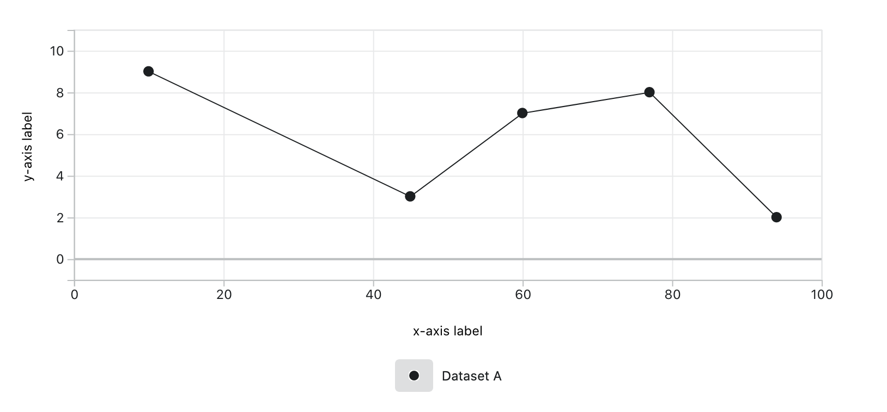

# Carbon Graphs

[](https://travis-ci.com/cerner/terra-graphs)


A vanilla JavaScript graphing library built using d3 based on Cerner design standards.

<br>


- [Installing Carbon](#installing-carbon)
- [Getting Started](#getting-started)
- [Graph Types](#graph-types)
- [LICENSE](#license)

## Installing Carbon

- Install from [npmjs](https://www.npmjs.com/package/@cerner/carbon-graphs) using the command below: 
```sh
npm i @cerner/carbon-graphs --save-dev
```

## Getting Started

To create a graph with carbon, first let's create a graph configuration object and use it to initialize that canvas:

```javascript
const GRAPH_DATA = {
  bindTo: "#root",
  axis: {
    x: {
      show: true,
      label: "x-axis label",
      lowerLimit: 0,
      upperLimit: 100
    },
    y: {
      show: true,
      label: "y-axis label",
      lowerLimit: 0,
      upperLimit: 10,
    },
  }
};

var canvas = Carbon.api.graph(GRAPH_DATA);
```

Let's create a sample dataset to plot:
```javascript
const CONTENT_DATA1 = {
  key: "uid_1",
  label: {
    display: "Dataset A"
  },
  values: [
    {
      x: 10,
      y: 9
    },
    {
      x: 45,
      y: 3
    },
    {
      x: 60,
      y: 7
    },
    {
      x: 77,
      y: 8
    },
    {
      x: 94,
      y: 2
    }
  ]
};
```

The data can now by plotted by as a line graph by using the following:

```javascript
    canvas.loadContent(Carbon.api.line(CONTENT_DATA1));
```

This results in the following graph:




## Graph types

The following graph types can be plotted using Carbon:

-   [Line](../terra-graphs-docs/docs/controls/Line.md#usage)
-   [Multi Line](../terra-graphs-docs/docs/controls/Line.md#multi-line)
-   [Spline Line](../terra-graphs-docs/docs/controls/Line.md#spline-line)
-   [Paired Result](../terra-graphs-docs/docs/controls/PairedResult.md#usage)
-   [Bar](../terra-graphs-docs/docs/controls/Bar.md#usage)
-   [Timeline](../terra-graphs-docs/docs/controls/Timeline.md#usage)
-   [Pie](../terra-graphs-docs/docs/controls/Pie.md#usage)
-   [Gantt](../terra-graphs-docs/docs/controls/Gantt.md#usage)
-   [Scatter](../terra-graphs-docs/docs/controls/Scatter.md#usage)
-   [Bubble](../terra-graphs-docs/docs/controls/Bubble.md#usage)
    -   [Bubble Single Dataset](../terra-graphs-docs/docs/controls/BubbleSingleDataset.md)
    -   [Bubble Multiple Dataset](../terra-graphs-docs/docs/controls/BubbleMultipleDataset.md)


## LICENSE

Copyright 2017 - present Cerner Innovation, Inc.

Licensed under the Apache License, Version 2.0 (the "License"); you may not use this file except in compliance with the License. You may obtain a copy of the License at

&nbsp;&nbsp;&nbsp;&nbsp;http://www.apache.org/licenses/LICENSE-2.0

Unless required by applicable law or agreed to in writing, software distributed under the License is distributed on an "AS IS" BASIS, WITHOUT WARRANTIES OR CONDITIONS OF ANY KIND, either express or implied. See the License for the specific language governing permissions and limitations under the License.
