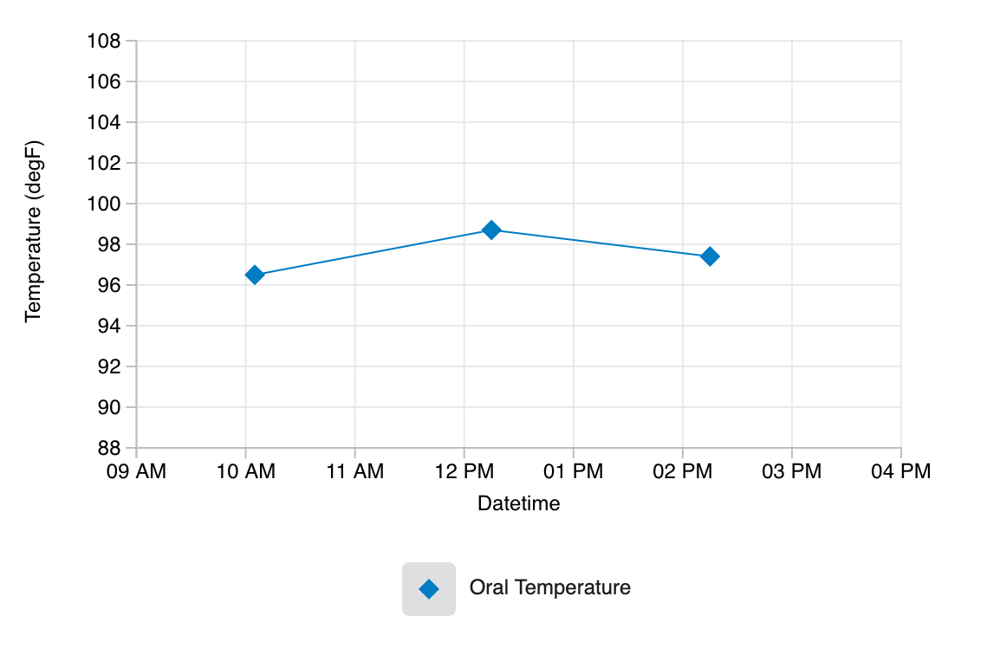

# Getting Started

-   [Getting Started](#getting-started)
    -   [Add Carbon to a Website](#add-carbon-to-a-website)
    -   [Add Carbon in your application](#add-carbon-in-your-application)
    -   [Drawing a Line Graph](#drawing-a-line-graph)

Now that you have installed `Terra Graphs`, let's see how we can integrate it with your source-code.

## Add Carbon to a Website

You can use Carbon in a `<script>` tag.

```html
<script src="dist/js/carbon-graphs.js"></script>
<link rel="stylesheet" type="text/css" href="dist/css/carbon-graphs.css" />
```

## Add Carbon in your application

Carbon is written using `ES2015` modules. Create a custom bundle using Rollup, Webpack, or your preferred bundler. To import Carbon into an ES2015 application:

```js
import Carbon from "@cerner/carbon-graphs/dist/js/carbon-graphs.js";
import "@cerner/carbon-graphs/dist/css/carbon-graphs.css";
```

## Drawing a Line Graph

Let’s see how easy it can be to get started!

To create a line graph, first create an HTML element that will hold the graph. Here, we are specifying a main element with an id of root.

```html
<main id="root"></main>
```

From there, we will initialize a JavaScript object that configures various aspects of the graph, including where the graph will be drawn and how the axes should appear.

```js
const graphConfiguration = {
    bindTo: "#root",
    axis: {
        x: {
            type: Carbon.helpers.AXIS_TYPE.TIME_SERIES,
            label: "Datetime",
            lowerLimit: new Date(2016, 0, 1, 9, 0).toISOString(),
            upperLimit: new Date(2016, 0, 1, 15, 59).toISOString()
        },
        y: {
            label: "Temperature (degF)",
            lowerLimit: 90,
            upperLimit: 106
        }
    }
};
```

Next, we’ll configure the data-set we want to plot.

```js
const dataset = {
    key: "uid_1",
    label: {
        display: "Oral Temperature"
    },
    shape: Carbon.helpers.SHAPES.RHOMBUS,
    color: Carbon.helpers.COLORS.BLUE,
    values: [
        {
            x: new Date(2016, 0, 1, 10, 5).toISOString(),
            y: 96.5
        },
        {
            x: new Date(2016, 0, 1, 12, 15).toISOString(),
            y: 98.7
        },
        {
            x: new Date(2016, 0, 1, 14, 15).toISOString(),
            y: 97.4
        }
    ]
};
```

And to wrap it all up, we’ll call `loadContent` to draw the content.

```js
const graph = Carbon.api.graph(graphConfiguration);
graph.loadContent(Carbon.api.line(dataset));
```

That’s it!


